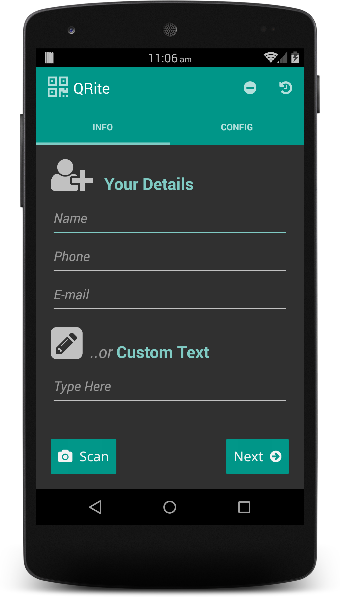
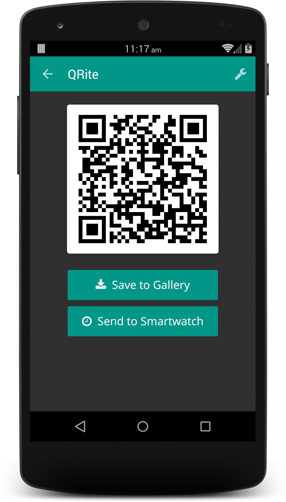

Tips/Donations : 

QRite
=====
QRite is an Android application for generating QR code vCards or custom QR codes easily.
You can customize size and color of the QR code, save it to your gallery and/or send it 
to an Android Wear or Pebble smartwatch. It has a much improved user-interface with a clean
and minimal look.

**_Note_**: As of now, this project is a work-in-progress and the code quality may be pretty bad
Do not hesitate in submitting patches and correcting me if something seems really weird ;)

Screenshots
-----------

See screenshots directory for more.

Features
--------
You can either choose to input your details for generating a vCard of just input any arbitrary text 
(such as a URL for your business or a link to a product info page or a coupon etc.) During or after 
the generation of the QR code, you can customize its size and color based on some presets.

*QR Code vCards* : You name, phone number and email are the only supported fields as of now so as to keep
the QR code easily legible to readers. This is also the minimum info you may want to give a new 
acquaintance contacts so that they can further ask you for details if needed.

*Custom Text* : If you do not wish to submit a detail but have a URL or custom text to share, 
you can use this field too. There are no restrictions on text in this field. So, remember Obi-wan, 
choose wisely :)

*Recent QR Codes* : The last 5 generated QR code info is saved so that you can quickly access it, in case 
you need to generate a QR code. Select the small icon on the top right of the app on the main screen
to access these recent items.

*Customization* : You can choose from some presets or specify a custom size (less than 1024px) for 
the QR code. You can also choose the colors from some available presets. This customization can also 
be done once the QR code is generated using the wrench menu on the top right in the QR code screen.

TODOs
-----
* ~~Get the size preset Card Views working~~
* Implement the scan and digitize feature
* Add smartwatch support for Pebble, Android Wear, SmartQ Z
* Code Refactoring
    - Separate threads for heavy duty stuff
    - Better management of generated drawables

Contributing
------------
Two ways - code or money. Patches, pull-requests for bugfixes, new features or code contributions to refactor my naïve 
Java coding attempt are very welcome :) To implement the smartwatch feature, I also need 
an Android Wear device and a Pebble. If you happen to have one and don't need it anymore, 
I would be happy to accept it. Or, consider buying the paid version of this app to support
development and help me buy one. Or, pay me directly. Or, ask someone to pay me.

Tips/Donations : 

License
-------
Code written by authors is released under LGPLv3. The app uses parts from Android such as 
SlidingTabLayout and ZXing library released under Apache Licence v2.0

Acknowledgements
----------------
Font Awesome by Dave Gandy - http://fontawesome.io for the icons used in this app.

Authors
-------
Suchakra Sharma  
Tanushri Chakravorty

